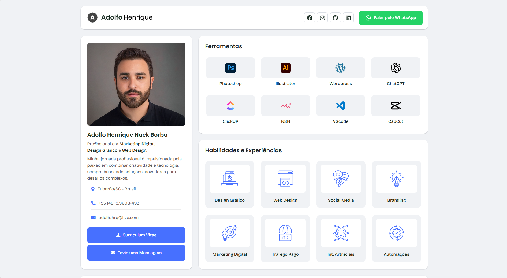

<p align="center">
  
</p>


# Adolfo Henrique - Portfólio Profissional | Desafio Alura Challenge

Bem-vindo ao meu portfólio profissional!
<br>
Este projeto foi desenvolvido como parte do **Desafio Alura Challenge | Front End**.
<br><br>
O objetivo é apresentar minhas habilidades em desenvolvimento web, aplicando técnicas aprendidas no curso e também conhecimentos que já havia adquirido ou que adquiri durante o processo de desenvolvimento. O resultado é um portfólio completo apresentando minhas ferramentas de trabalho, habilidades e experiências e por fim alguns projetos que já desenvolvi ao longo da minha carreira profissional.

---


# Portfólio Profissional - Adolfo Henrique

👋 Bem-vindo ao meu portfólio profissional! Este projeto foi desenvolvido como parte do **Desafio Alura Challenge | Front End**.  
O objetivo é apresentar minhas habilidades em desenvolvimento web, aplicando técnicas aprendidas no curso e também conhecimentos que já havia adquirido ou que obtive durante o processo de desenvolvimento. O resultado é um portfólio completo e responsivo que reflete minha evolução e experiência na área.

---


## 🚀 Tecnologias

- **HTML5**
- **CSS**
- **JavaScript**
- **jQuery**
- **Bootstrap 5**

## 📓 Bibliotecas de Terceiros

- **Font Awesome**
- **Magnific Popup**
- **Slick Carousel**

## 🌟 Funcionalidades

- **Menu Responsivo**
- **Galeria Interativa**
- **Filtros de Projetos**
- **Slider Dinâmico**
- **Animações Suaves**
  
## 📂 Estrutura do Projeto

A organização do projeto está dividida em diferentes pastas para facilitar a manutenção e escalabilidade:

- `index.html` - Página principal do portfólio.
- `assets/css/` - Estilos e configurações de responsividade.
- `assets/js/` - Scripts para funcionalidades interativas e dinâmicas.
- `assets/img/` - Imagens e ícones utilizados no projeto.

## 🎯 Como Visualizar
- Acesse https://challenge.adolfohenrique.com.br/
 
- Clone o repositório:
   ```bash
   git clone https://github.com/adolfohrq/adolfo-challenge-portfolio.git
   ```

---

Desenvolvido com 💙 por Adolfo Henrique
